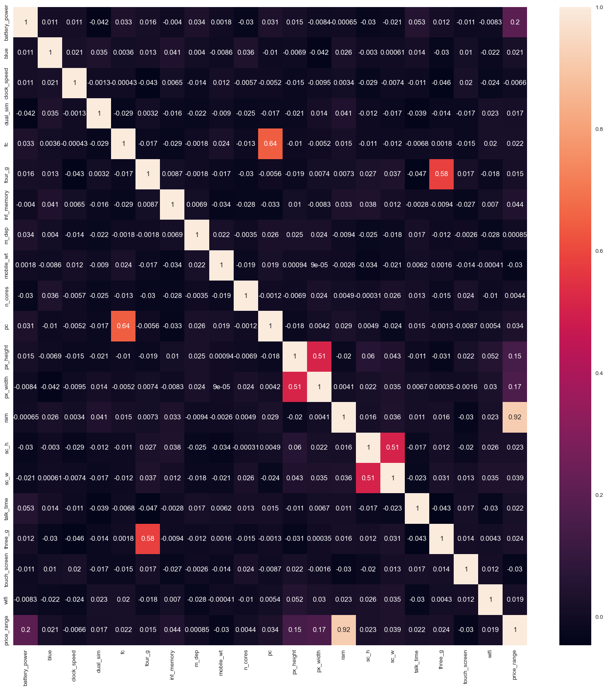

)
)

Badge [source](https://shields.io/)

# Key findings: People with the highest income, and who have at least one partner, are more likely to be approved for a credit card.

## Authors

- [@beersk1](https://www.github.com/beersk1)

## Table of Contents

  - [Business problem](#business-problem)
  - [Data source](#data-source)
  - [Methods](#methods)
  - [Tech Stack](#tech-stack)
  - [Quick glance at the results](#quick-glance-at-the-results)
  - [Conclusion](#conclusion)
  - [Improvements](#limitation-and-what-can-be-improved)
  - [Explore the notebook](#explore-the-notebook)
  - [Deployment on streamlit](#deployment-on-streamlit)
  - [App deployed on Streamlit](#app-deployed-on-streamlit)
  - [Contribution](#contribution)
  - [License](#license)

## Business problem

The business problem that the program addresses is the ability to predict the price of a mobile phone based on its features. This can be useful for various stakeholders, such as mobile phone manufacturers, retailers, and consumers.

For manufacturers, being able to accurately predict the price of a mobile phone based on its features can help them make informed decisions about product development, pricing strategies, and market positioning.

For retailers, being able to predict the price of a mobile phone can help them set competitive prices and manage inventory levels effectively.

For consumers, being able to predict the price of a mobile phone can help them make informed purchasing decisions based on their budget and desired features.

Overall, the ability to predict the price of a mobile phone based on its features can provide valuable insights and benefits for various stakeholders in the mobile phone industry.

## Data source

- [Kaggle mobile price classification](https://www.kaggle.com/datasets/iabhishekofficial/mobile-price-classification)

## Methods

- Exploratory data analysis
- Correlation
- Model Selection 
- S3 bucket model hosting
- Model deployment

## Tech Stack

- Python (refer to requirement.txt for the packages used in this project)
- Streamlit (Interface for the model)
- AWS S3 (Model Storage)

## Quick glance at the results

Correlation between the features.

Confusion matrix of gradient boosting classifier.

Top 3 models (with default parameters)

| Model                     | Score |
|-------------------	      |------------------	|
| Logistic Regression	      |96% | 
| Lda                       |	93% | 
| Random Forest Classifier	|87% |
| SVC	                      | 85% |
| Decision Tree Classifier	| 80% |
| KNN	                      | 44% |

- **The final model used for this project: Logisitc Regression**
- **Evaluaion Metric used: Accuracy Score**
- **Why choose Accuracy as an evaluation metric: **

 Accuracy is the most straightforward evaluation metric that measures the percentage of correct predictions made by the model. It is calculated by dividing the number of correctly predicted instances by the total number of instances in the dataset.

Since your classes are balanced, accuracy will be an appropriate metric to use because it measures the overall correctness of your model without bias towards any specific class.
However, you may also want to consider using other metrics such as precision, recall, or F1 score, which can provide more insights into the model's performance on individual classes.

 Precision: Precision is a metric that measures the proportion of correctly predicted positive instances over the total number of instances predicted as positive. In other words, precision measures how accurate the model's positive predictions are. A high precision means that the model is very good at predicting positive instances, and a low precision means that the model is making many false positive predictions.

Recall: Recall is a metric that measures the proportion of correctly predicted positive instances over the total number of actual positive instances in the dataset. In other words, recall measures how well the model identifies positive instances. A high recall means that the model is very good at identifying positive instances, and a low recall means that the model is missing many actual positive instances.

F1 Score: The F1 score is the harmonic mean of precision and recall. It combines both metrics into a single score that balances both precision and recall. The F1 score is a good metric to use when you want to evaluate the overall performance of a model and compare it to other models. The F1 score ranges from 0 to 1, with a higher value indicating better performance.

## Conclusion

 **Lessons learned and recommendation**

- Based on this project's analysis, Battery Power and Ram are the  most predictive features in determining the price of the mobile phone. Other features like device Size, 4G status and Internal Memory are also helpful. The least useful features are Device depth and touchscreen status.
- The recommendation would be to focus more on the most predictive features when looking at the applicant profile and pay less attention to the least predictive features.

## Limitation and what can be improved

- Combine this model with with a regression model to predict how much of a credit limit an applicant will be approved for.
- Hyperparameter tuning with grid search or random search.
- Collect Datasets containing accurate prices to train a regression model on the same.
- Retrain the model without the least predictive features

## Explore the notebook

To explore the notebook file [here](https://github.com/beersk1/mobile-price-prediciton-classification/blob/main/mobile_price_prediction.ipynb)

## Deployment on streamlit

To deploy this project on streamlit share, follow these steps:

- first, make sure you upload your files on Github, including a requirements.txt file
- go to [streamlit share](https://share.streamlit.io/)
- login with Github, Google, etc.
- click on new app button
- select the Github repo name, branch, python file with the streamlit codes
- click advanced settings, select python version 3.9 and add the secret keys if your model is stored on AWS or GCP bucket
- then save and deploy!

## App deployed on Streamlit

Video to gif [tool](https://ezgif.com/)

## Contribution

Pull requests are welcome! For major changes, please open an issue first to discuss what you would like to change or contribute.

## License

MIT License

Copyright (c) 2022 Stern Semasuka

Permission is hereby granted, free of charge, to any person obtaining a copy
of this software and associated documentation files (the "Software"), to deal
in the Software without restriction, including without limitation the rights
to use, copy, modify, merge, publish, distribute, sublicense, and/or sell
copies of the Software, and to permit persons to whom the Software is
furnished to do so, subject to the following conditions:

The above copyright notice and this permission notice shall be included in all
copies or substantial portions of the Software.

THE SOFTWARE IS PROVIDED "AS IS", WITHOUT WARRANTY OF ANY KIND, EXPRESS OR
IMPLIED, INCLUDING BUT NOT LIMITED TO THE WARRANTIES OF MERCHANTABILITY,
FITNESS FOR A PARTICULAR PURPOSE AND NONINFRINGEMENT. IN NO EVENT SHALL THE
AUTHORS OR COPYRIGHT HOLDERS BE LIABLE FOR ANY CLAIM, DAMAGES OR OTHER
LIABILITY, WHETHER IN AN ACTION OF CONTRACT, TORT OR OTHERWISE, ARISING FROM,
OUT OF OR IN CONNECTION WITH THE SOFTWARE OR THE USE OR OTHER DEALINGS IN THE
SOFTWARE.

Learn more about [MIT](https://choosealicense.com/licenses/mit/) license

